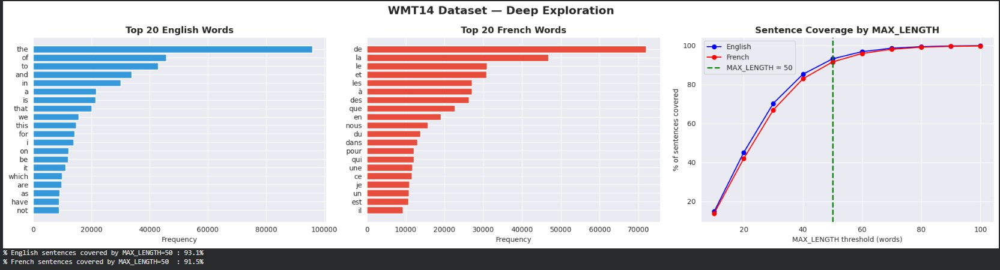
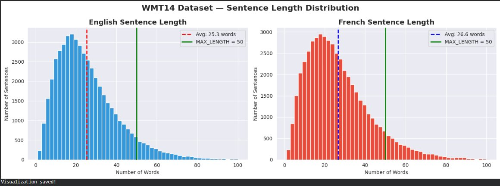
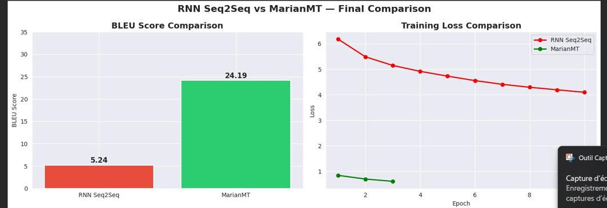

# Machine Translation: RNN Seq2Seq vs MarianMT

A head-to-head comparison of two machine translation architectures — a classical GRU-based Seq2Seq model trained from scratch and a fine-tuned MarianMT transformer — translating English to French.

## Overview

| | |
|---|---|
| **Task** | English → French machine translation |
| **Dataset** | [WMT14 English-French](https://huggingface.co/datasets/wmt/wmt14) (via HuggingFace) — 50,000 parallel sentence pairs, 40k train / 10k test |
| **Models** | RNN Seq2Seq (GRU encoder-decoder, trained from scratch) vs `Helsinki-NLP/opus-mt-en-fr` (MarianMT, fine-tuned) |
| **Frameworks** | PyTorch, HuggingFace Transformers, sacreBLEU |

## Dataset





Average sentence length: 25.3 words (English), 26.6 words (French). A `MAX_LENGTH = 50` cutoff was chosen, covering 93.1% of English and 91.5% of French sentences. Vocabulary size was increased from 10,000 to 20,000 words per language after the initial run showed a 48.9% unknown-word rate in French — a result of French's richer verb conjugation and gender agreement compared to English.

## Results

| Metric | RNN Seq2Seq | MarianMT |
|---|---|---|
| BLEU Score | 5.24 | **24.19** |
| Final Training Loss | 4.09 | 0.60 |
| Parameters | ~22.9M | ~75M |
| Training Epochs | 10 | 3 |
| Pretrained | No | Yes |
| Architecture | GRU Seq2Seq | Transformer |



MarianMT scored **24.19 BLEU** — a "decent translation" by standard BLEU interpretation (20–29 range) — compared to the RNN's **5.24 BLEU**, which falls in the "almost useless" range. The RNN's higher final loss (4.09) also reflects the inherent difficulty of generating from a 20,000-word vocabulary at every decoding step from a randomly-initialized model, versus MarianMT's loss of 0.60 after fine-tuning a model that already understood both languages.

## Key Findings

- **Pretraining matters enormously for translation.** With only 3 fine-tuning epochs, MarianMT outperformed a from-scratch RNN trained for 10 epochs by more than 4x in BLEU score — its prior training on millions of parallel sentences gave it a near-insurmountable head start.
- **The RNN's single context vector is a bottleneck.** The classical Seq2Seq architecture compresses an entire source sentence into one fixed-size vector before decoding, which loses information — especially on longer sentences. This is the exact limitation that motivated the invention of attention mechanisms (and eventually, the Transformer).
- **Vocabulary coverage required iteration.** The first vocabulary pass (10k words/language) left nearly half of French sentences with unknown-word tokens; doubling the vocabulary to 20k brought the French unknown-word rate down to 19.4%.
- **Resource trade-off**: the RNN is ~3x smaller and trains from scratch on a single GPU in a reasonable time, while MarianMT relies on a much larger pretrained model — a real consideration when pretrained checkpoints aren't available for a target language pair.

## Pipeline

1. **EDA** — sentence length distributions, vocabulary frequency analysis, coverage analysis to choose `MAX_LENGTH`
2. **Preprocessing**
   - Cleaning: lowercasing, special character handling
   - RNN: word-level vocabulary (20k words/language) with `<SOS>`/`<EOS>`/`<PAD>`/`<UNK>` tokens, padded to 50 tokens
   - MarianMT: native `MarianTokenizer` (subword tokenization)
3. **Model training**
   - RNN: GRU Encoder → context vector → GRU Decoder, trained with teacher forcing (ratio 0.5)
   - MarianMT: `Helsinki-NLP/opus-mt-en-fr` fine-tuned end-to-end at a low learning rate (5e-5)
4. **Evaluation** — BLEU score (sacreBLEU) on the held-out test set for both models

## Repo Structure

```
├── NLP_MachineTranslation_RNN_vs_MarianMT.ipynb   # Full notebook: EDA → preprocessing → training → BLEU evaluation
├── rnn_loss_curve.png                             # RNN Seq2Seq training loss curve
├── wmt14_deep_exploration.png                     # Top words + sentence coverage analysis
├── wmt14_sentence_length_distribution.png         # EN/FR sentence length histograms
├── final_comparison.png                           # BLEU score + training loss comparison
└── NLP_Report_Final.docx                          # Full written report
```

## Tech Stack

`Python` `PyTorch` `HuggingFace Transformers` `sacreBLEU` `pandas` `matplotlib` `seaborn`

## Author

**Imene Chehata** — [LinkedIn](https://www.linkedin.com/in/chehata-imene-59b347311)
